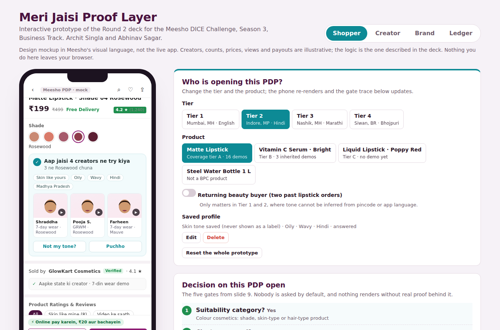
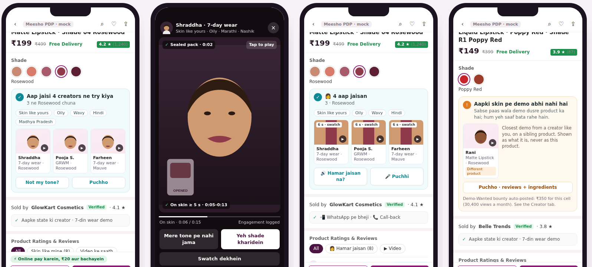

# Meri Jaisi Proof Layer — interactive prototype

**Meesho DICE Challenge S3 · Business Track · Prototype Submission Round**
Archit Singla · Abhinav Sagar

Creator demos become suitability-matched proof on the Meesho PDP, scaled across clusters with AI, and paid on delivered conversions. This is a clickable version of our Round 2 deck: the shopper's PDP, the creator programme, the brand coverage matrix and the attribution ledger, running end to end on mock data.



## Two-minute walkthrough for judges

1. **Shopper tab, Tier 2, Matte Lipstick.** Nothing is asked on page load. Tap the chip on the product image (“Meri jaisi skin pe dekho”). The 3-tap quiz opens: closest face on a 6-band scale, skin and hair, language pre-filled from the app. Finish it and the best-matched demo plays.
2. **Watch the demo.** The sealed pack opens at 0:02, product is on skin from 0:05. Tap “Yeh shade kharidein”, place the order. The confirmation names the demo that gets attributed and why.
3. **Ledger tab.** Deliver the order, end the 7-day return window. ₹12 (60% of the link rate on ₹199) releases to the creator. Try “Return” or “Refuse at door” on a second order to see nothing pay out.
4. **Creator tab.** The creator's earnings now include that payout. Confirm her AI-pre-filled attribute profile in one tap, submit a demo through the QC gate, and see the payout throttle (full / half / none per tone band).
5. **Brand tab.** The Shade-Coverage matrix shows which tone × language cells have views but no demo. Fund a kit into an empty cell; it appears on the creator's Demo-Wanted board. Trip the return-rate circuit breaker and the Vitamin C Serum (coverage tier B, inherited demos) falls back to the honest “no demo yet” state.
6. **Back on Shopper.** Switch to Tier 3 and Tier 4: no quiz, matched from pincode and app language, regional copy, 6-second 240p clips, and a swatch-strip image fallback. Switch to the Liquid Lipstick (tier C) for the honest empty state, and the Steel Water Bottle to see the Proof Layer stay out of a non-beauty PDP entirely.



## What is in it

| Tab | Who it is for | What it shows (deck slide) |
|---|---|---|
| Shopper | The buyer | Mock Meesho PDP with chip A, match module B, review filter C and 3-tap quiz D; tier switcher for Tier 1–4 capture; live trace of the five gates on every PDP open; Puchho Q&A grounded only in demos, matched reviews and ingredients (slides 6, 9) |
| Creator | The Creator Club member | Tag (AI-pre-filled attribute vector, confirm in one tap, delete), Attach (reel → cluster mapping with confidence, QC gate), Demo-Wanted board with bounties, earnings per demo with 90-day window (slides 5, 8) |
| Brand | The seller / brand | Shade-Coverage dashboard (cluster × tone band × language), fund-a-kit into empty cells, return-rate circuit breaker on inherited demos, “didn't suit my tone” as a routing signal (slides 5, 7, 8) |
| Ledger | The platform | Attribution rules applied to every event: what pays, what never pays, the 90-day cap, margin neutrality; payout throttle per tone band (slides 5, 7) |

## What is real and what is mocked

| Element | Status |
|---|---|
| Gate logic (5 gates, never/fallback rules) | Implemented as written on slide 9 |
| Matching (tone distance → skin/hair → language → region; language-first in Tier 3/4) | Implemented, rule-based (the v0 ranker). Weights are ours, to be replaced by learning-to-rank on delivered-not-returned conversion in v1 |
| Attribution (deliberate engagement, 90-day window, pay after delivery + return window, last-engaged wins, one payout per user × cluster, never-pays list) | Implemented; all events are logged in-session |
| Payout throttle, Demo-Wanted bounties, kit funding, circuit breaker | Implemented |
| Tier-wise capture and copy | Implemented. Regional copy is illustrative and would be creator-approved before launch |
| Creators, demos, reviews, views, prices, orders | Mock data, chosen to be plausible. Avatars are abstract; no real people |
| Videos | Simulated player with the QC markers (sealed pack at 0:02, on skin from 0:05) |
| Payment, delivery, returns | Simulated with buttons so the money can be followed |
| Screens | Design mockups in Meesho's visual language, not live app screenshots |
| Persistence | The shopper's saved quiz lives in the browser's localStorage only. Nothing leaves the browser |

One deliberate change from the deck's static mock on slide 6: the module never shows a tone word (the mock showed “Wheatish”). Slides 7 and 9 say the UI only ever says “like you”, so the prototype follows that rule.

## Run it

Open `index.html` in any browser. No build step or dependencies are required.

## Repository layout

```
index.html            the whole prototype (HTML, CSS and JavaScript in one file)
README.md             this file
screenshots/          images used above
```

